# WEDE5020-POE
A repository for my web development assignment in wede5020

# Chubby Chums

## Student Information
- **Name:** Olothando Mabuto
- **Student Number:** ST1052487
- **Module:** WEDE5020

## Project Overview
Chubby Chums is a non-profit child protection organization founded in 1999 by Tony Barnard and Martin Graham to help impoverished, diseased, and abused children. Starting from a single enclosed veranda, the organization has grown to incorporate 36 children's homes. It was officially registered as a Section 21 corporation in 2000, and is recognized as a Non-Profit Organization (NPO), Non-Government Organization (NGO), and Public Benefit Organization (PBO) (Chubby Chums, 2026).

Chubby Chums works in partnership with Child Protection Units and Child Treatment Services to stop child abuse, child neglect, and child exploitation, and to promote the importance of Early Childhood Development (ECD). The organization primarily operates in Johannesburg and the Far East Rand Regions (Chubby Chums, 2026).

This website redesign project aims to modernize the organization's online presence, making it more informative, accessible, and functional for visitors, donors, and people needing to report concerns about a child's welfare.

**Target Audience:** Children in need — including those in abusive households, those living in poverty, and those struggling with illnesses and diseases — along with the general public, donors, and potential volunteers (Chubby Chums, 2026).

## Website Goals and Objectives
The goal of the website is to provide key insights into the Chubby Chums organization and its operations — detailing where, why, and how it operates — while also providing clear information on contacting Chubby Chums and reporting child neglect or abuse to child protection services. The website also gives visitors a direct way to donate.

**Key Performance Indicators (KPIs):**
- **Website Traffic** — how many people are visiting the site and learning about Chubby Chums
- **Monthly Donations** — number of donations made via the website each month
- **Recurring Donors** — number of donors who continue to donate over time
- **Average Donation Amount** — average amount donated per donor
- **Conversion Rate** — percentage of visitors who go on to donate

## Key Features and Functionality
- Consistent navigation across all pages: Home, About, Donate, Enquiry, Contact, styled as colour-coded pill buttons using Flexbox
- **Home page** introducing the organization and its mission, with a hero section, mission statement, and a card-based row linking to About, Donate, Enquiry, and Contact
- **About page** with detailed history, registration status, and partnerships, using alternating text/image layouts
- **Enquiry page** allowing visitors to report suspected child abuse or neglect, with emergency contact numbers (SAPS and Childline) and a styled report form alongside a supporting image
- **Contact page** with phone, email, physical address, and a styled general contact form
- **Donate page** with full banking details and official registration/compliance information, presented in bordered information panels
- Fully responsive layout using CSS Flexbox, tested and adjusted at desktop, tablet (≤768px), and mobile (≤480px) breakpoints
- Custom-styled form elements (inputs, select, textarea) with consistent focus/hover/active states across the site

## Design Direction
The original proposal specified a colour scheme of white, black, yellow, blue, and green on a light background, using Arial. During the CSS phase, this was revised:

- **Colour palette expanded** to red (`#FF0000`), green (`#1AFF00`), yellow (`#FFF200`), blue (`#00A2FF`), orange (`#FF9900`), and purple (`#BF00FF`), with black (`#000000`) and white (`#FFFFFF`) used for text and background, to increase the colourful, child-friendly feel while keeping content readable.
- **Background inverted from light to dark** (black background, white text) after prototyping both options. This was chosen because the brighter accent colours read more vividly against black, photographs of children/donations sit well against a dark background, and white nav-link text improved readability against the blue and purple accent buttons specifically.
- Arial (with Helvetica/sans-serif fallbacks) was retained as originally proposed.

## Timeline and Milestones
- **14 August 2026** — Proposal and HTML framework
- **18 September 2026** — Applying CSS, responsive design, and improving UI/UX

## Part 1 Details
Part 1 covers the initial proposal and static HTML framework: page structure, navigation, and core content for the Home, About, Enquiry, Contact, and Donate pages, built without CSS or JavaScript.

## Part 2 Details
Part 2 covers visual design and responsiveness across all five pages:
- An external stylesheet (`CSS/chubbychums.css`) linked to every page
- A base style and CSS reset (`* { margin: 0; padding: 0; box-sizing: border-box; }`) to normalise browser defaults
- A typographic scale (h1 2.5rem, h2 2rem, body text 1rem, `line-height: 1.5` for readability) using `rem` units for accessibility
- Flexbox-based layouts for the navigation bar, hero sections, the home page's card row, and the enquiry page's form/image section, including nested flex containers for the card components
- Visual styling using `color`, `background-color`, `border`, and rounded corners (`border-radius`) throughout, plus `:hover`, `:focus`, and `:active` pseudo-classes for interactive feedback on links and form fields
- Responsive design implemented with media queries at 768px (tablet) and 480px (mobile), switching Flexbox rows to a stacked column layout on smaller screens and scaling down heading font sizes on mobile
- Screenshot evidence of the site at desktop, tablet, and mobile widths (see `/screenshots` — 15 screenshots covering all five pages at three breakpoints)

## Responsive Design Evidence

The site was tested and verified at three breakpoints — desktop, tablet (≤768px), and mobile (≤480px) — using browser developer tools' device toolbar. Screenshots for all five pages at each breakpoint are below.

### Desktop
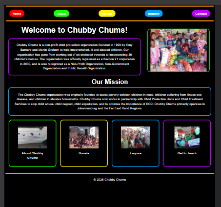
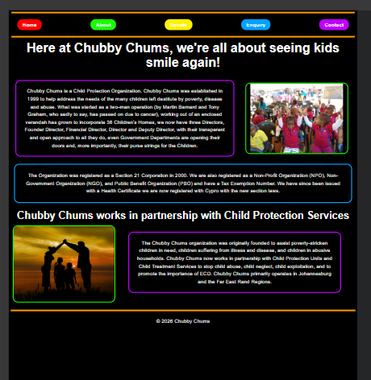
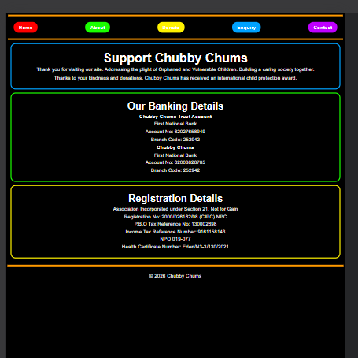
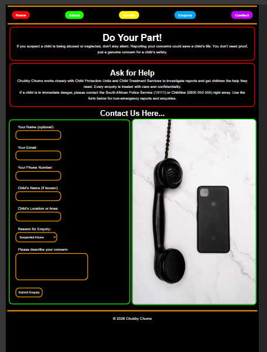
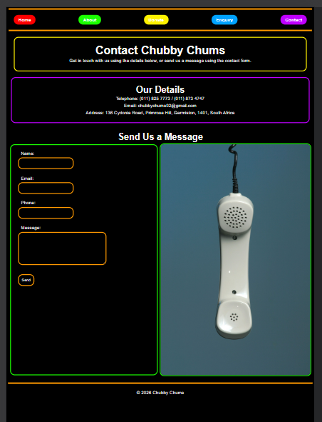

### Tablet (768px)
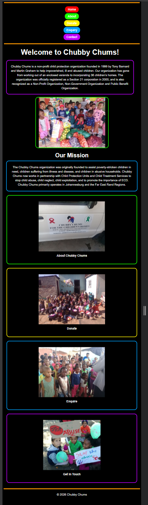
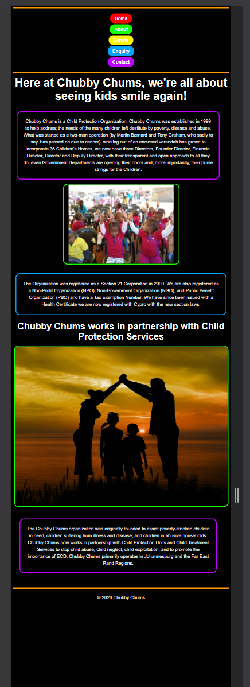
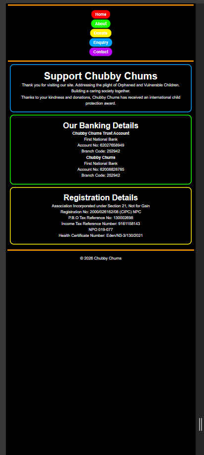
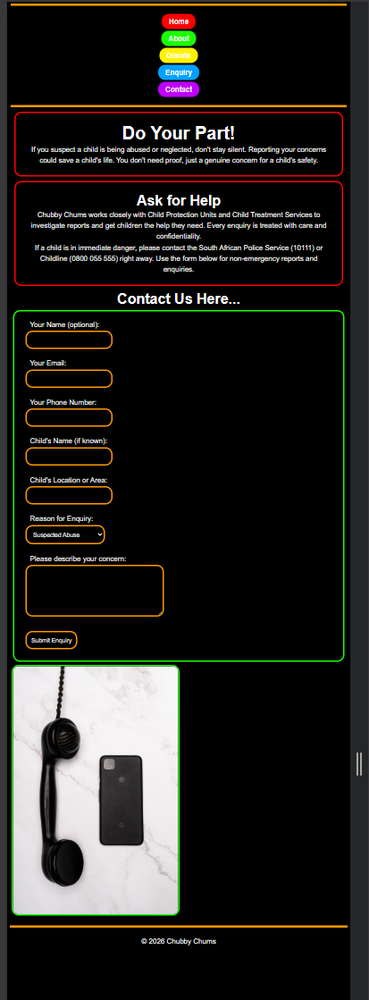
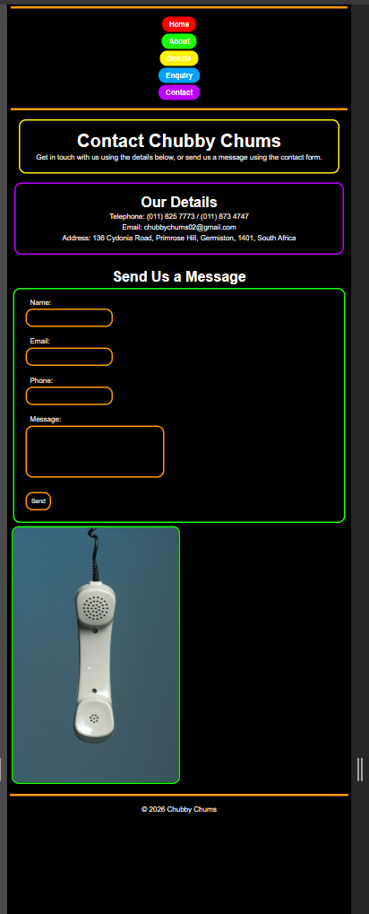

### Mobile (480px)
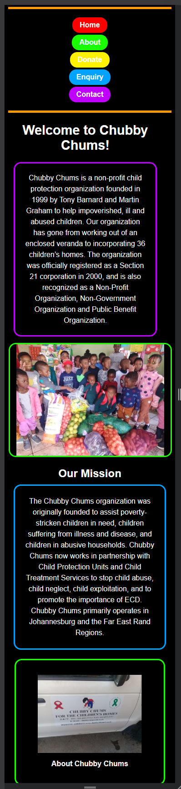
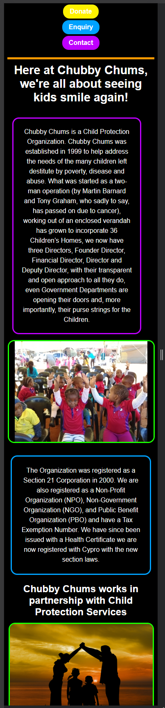
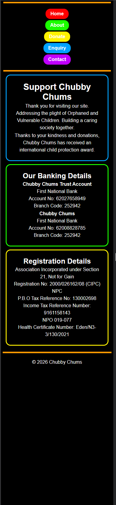
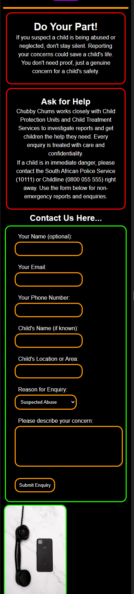
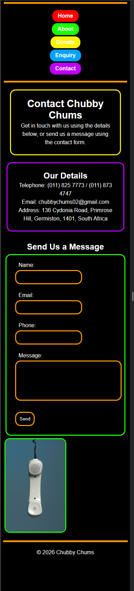

Part 3 (further interactivity and refinement) will follow in a future submission.

## Sitemap
Home (index.html)
|-- About (about.html)
|-- Donate (donate.html)
|-- Enquiry (enquiry.html)
|-- Contact (contact.html)

## Changelog
- Created `index.html` — homepage with mission and services overview
- Created `about.html` — organizational history and partnerships
- Added `contact.html` — contact details and general contact form
- Added `enquiry.html` — child abuse/neglect reporting form with emergency contacts
- Added `donate.html` — banking details and registration information
- Added HTML comments across all pages for clarity and maintainability
- Linked external stylesheet (`CSS/chubbychums.css`) to all pages
- Established base styles, CSS reset, and typographic scale
- Expanded colour palette (added red, purple, additional accents beyond original proposal) and inverted site theme from light to dark background
- Built Flexbox navigation bar with colour-coded, rounded pill-style links and hover/focus/active states
- Built Flexbox hero sections (text + image) on the home and about pages
- Built nested Flexbox card row on the home page linking to About, Donate, Enquiry, and Contact
- Styled and structured the enquiry form (labels, inputs, select, textarea) with a supporting image in a Flexbox layout
- Styled the contact form to match the site-wide input/select/textarea design
- Added responsive media queries (768px and 480px breakpoints) across all pages, converting Flexbox rows to stacked columns and scaling typography on smaller screens
- Captured screenshot evidence of all five pages at desktop, tablet, and mobile widths

## References
Chubby Chums. (2026). *Chubby Chums.* Available at: https://www.chubbychums1.co.za [Accessed 2026].

Lamaj, D. (2026). *Low fidelity wireframe.* Available at: https://uxpilot.ai/blogs/low-fidelity-wireframe [Accessed 2026].

Lucidity. (2026). *The complete list of charity KPIs.* Available at: https://getlucidity.com/strategy-resources/the-complete-list-of-charity-kpis/#Awareness_KPIs [Accessed 2026].

Mason, L. (2026). *Website hosting cost.* Forbes Advisor. Available at: https://www.forbes.com/advisor/business/website-hosting-cost/ [Accessed 2026].